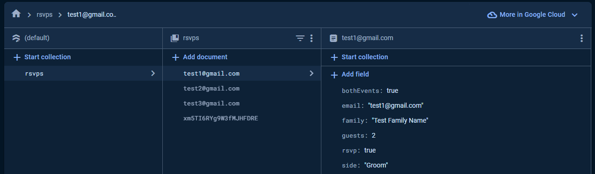

# Wedding Application

Welcome to the Wedding project!

The Wedding project aims to provide a stress-free digital RSVP (Response-For-Attendance) system. It facilitates the seamless management of guest responses, event segregation, and the collection of additional information such as dietary restrictions and special requests.

The application is developed on a modern and responsive tech stack. It utilizes React for UI development, Vite for efficient builds, and Axios for managing API requests. Firebase supports backend functionality, EmailJS is used for automated communication and Swiper is integrated for touch sliders. TypeScript ensures type safety, while ESLint, Prettier, and Husky maintain code quality. The styling is accomplished with Sass. This combination of technologies ensures a robust, feature-rich, and responsive React application.

This document is meant to help new developers to quickly get up and running in a straight forward fashion. Please review the below documentation before getting started. I promise it's not that long.

## Dependencies

**Please ensure that your development machine has the below dependencies installed before running or working with this project**

- Node (>=16.0.0)
- Yarn (>=1.22.0)

---

## Commands

### Download dependencies

This command will download all `node_modules` required for the project, it is good to run this command from time to time to ensure your development machine is up to date with all the latest modules

```
  yarn install
```

_If your application is throwing errors stating something along the lines of `not found` please run this command to first see if your modules are out of date_

```
  yarn --check-files
```

_the `--check-files` flag ensures the command does a deep check to ensure that all modules imported by the embedded modules are up to date as well_

---

### Run in Development Mode

This command will run the vite builder and deploy the code live:

```
  yarn dev
```

---

### Eslint

This command will lint all files:

```
  yarn lint
```

---

### Creating builds

This command will run and output the build files to the `dist` folder:

```
yarn build
```

---

### Environmental Variables

You must create a ".env" file on the root of the project with the following properties:

```
// EmailJS
VITE_SERVICE_ID=
VITE_TEMPLATE_ATTENDING_ID=
VITE_TEMPLATE_DECLINE_ID=
VITE_PUBLIC_KEY=

// FireBase
VITE_API_KEY=
VITE_AUTH_DOMAIN=
VITE_PROJECT_ID=
VITE_STORAGE_BUCKET=
VITE_MSG_SENDER_ID=
VITE_APP_ID=
```

---

### FireBase

[FireBase Official Website](https://firebase.google.com/)

I decided to use the Firestore Database from FireBase for this project to help manage RSVP's easily. You must sign up for an account using the link above. The following tutorial will help get you set up with a database. Remember to populate your environmental variables for FireBase.

[Firestore Database Tutorial](https://www.youtube.com/watch?v=F7t-n5c7JsE&t=2233s)

Using FireBase we are able to store our guests in the following format:



```
  {

    // guest email address (same as the document name)
    email: 'test@gmail.com',

    // if guest is invited to wedding and reception
    bothEvents: true,

    // family name for EmailJS purposes
    family: 'Test Family Name',

    // number of guests
    guests: 2,

    // which side the guest has been invited from
    side: 'Groom',

    // this flag manages whether the guest has rsvped or not
    rsvp: true
  }
```

It could take an unreasonable amount of time to enter each guest into the database manually. I therefore created a mock data file called guests.ts and a function to add each guest to the database. Just create a button and attach the function to the onClick handler for it.

Interface:

```
export interface Data {
  email: string;
  bothEvents: boolean;
  family: string;
  guests: number;
  side: string;
  rsvp: boolean;
}
```

Data:

```
import { Data } from '@interfaces/types';

const GuestSchema: Data[] = [
  {
    email: 'test1@gmail.com',
    bothEvents: false,
    family: 'test one',
    guests: 5,
    side: 'Bride',
    rsvp: false
  },
  {
    email: 'test2@gmail.com',
    bothEvents: true,
    family: 'test two',
    guests: 2,
    side: 'Groom',
    rsvp: false
  },
];

export default GuestSchema;
```

Add each guest to the DB:

```
const addData = () => {
  const dbRsvp = collection(db, 'rsvps');

  guests.forEach((guest) => {
    setDoc(doc(dbRsvp, guest.email), {
      email: guest.email,
      bothEvents: guest.bothEvents,
      family: guest.family,
      guests: guest.guests,
      side: guest.side,
      rsvp: guest.rsvp
    }).catch((err: Error) => console.error('err', err));
  });
};
```

---

### EmailJS

[EmailJS Official Website](https://www.emailjs.com/)

In order for EmailJS to work, you will need to sign up for a free account using the provided link above. Create two email templates and remember to populate your environmental variables for EmailJS.

[EmailJS Tutorial](https://www.youtube.com/watch?v=wWiTouBHibs)

Template 1:


Template 2:

